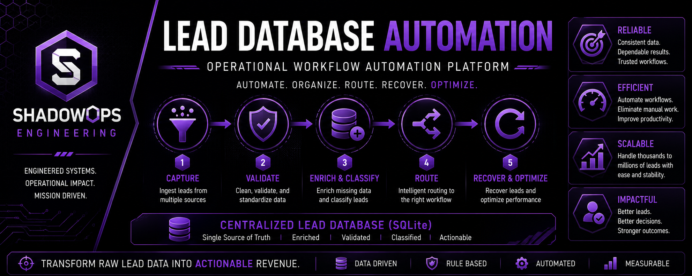
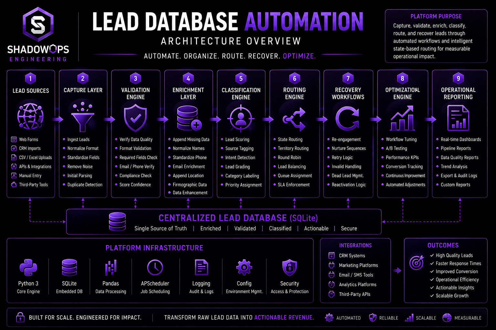
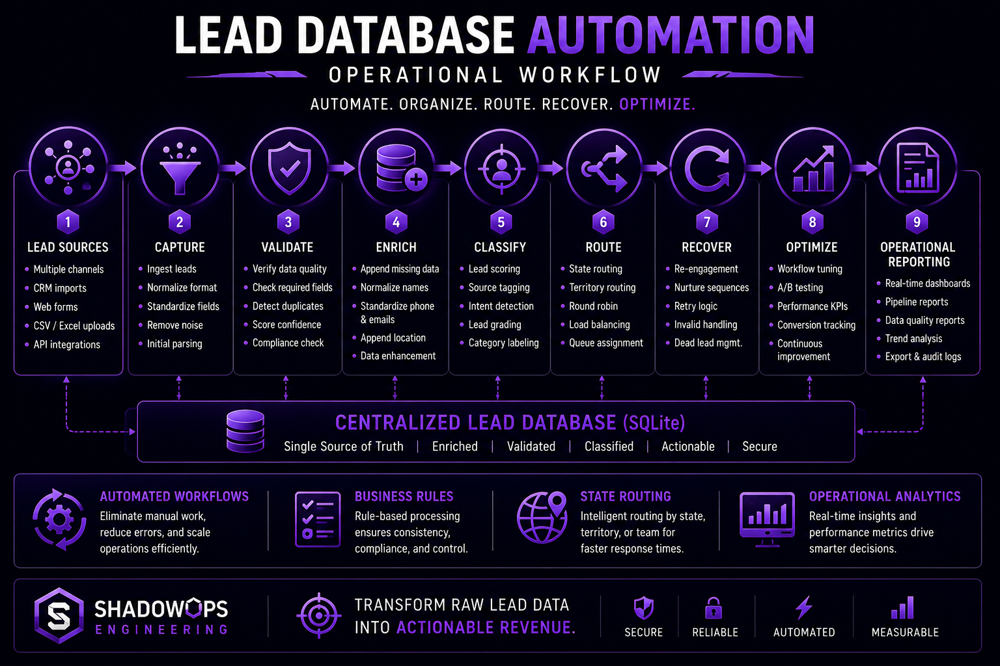

<p align="center">
  
</p>

# Lead Database Automation

## Operational Workflow Automation Platform

**A modular Python platform for lead processing, validation, routing, classification, workflow automation, operational reporting, and lifecycle management.**

---

# Executive Summary

Lead Database Automation is a production-oriented workflow automation platform engineered to organize, validate, enrich, classify, and route large operational lead databases.

Rather than functioning as a collection of standalone scripts, the repository represents an integrated automation platform where each processing module performs a clearly defined operational responsibility within a scalable workflow.

The platform emphasizes automation, repeatability, operational visibility, routing intelligence, and measurable workflow performance.

---

# Why This Platform Exists

Organizations processing large lead datasets frequently encounter operational inefficiencies that reduce productivity and increase manual effort.

Common challenges include:

- Duplicate lead records
- Inconsistent formatting
- Missing information
- Manual routing
- State-specific workflows
- Poor lead classification
- Recovery bottlenecks
- Limited operational visibility

Lead Database Automation was developed to replace repetitive manual processing with structured, rules-based automation.

---

# Engineering Philosophy

Operational growth depends on removing repetitive work from people and placing it into reliable systems.

Every module within this repository exists to automate a specific operational decision while maintaining transparency, consistency, and scalability.

The emphasis is not on scripting individual tasks.

The emphasis is on engineering repeatable operational systems.

---

# Platform Objectives

The platform was engineered around five principles.

## Automation

Reduce repetitive manual effort.

## Reliability

Generate deterministic workflow outcomes.

## Scalability

Support very large lead databases.

## Visibility

Provide operational reporting throughout every workflow.

## Optimization

Continuously improve workflow performance and routing efficiency.

---

# High-Level Architecture

<p align="center">
  
</p>

The platform separates operational processing into modular stages that independently validate, enrich, classify, route, recover, and report on lead data.

Core processing stages include:

- Capture
- Validation
- Enrichment
- Classification
- Routing
- Recovery
- Reporting

---

# Operational Workflow

<p align="center">
  
</p>

Typical workflow execution includes:

1. Capture lead data
2. Validate records
3. Enrich missing information
4. Classify operational attributes
5. Route leads into workflows
6. Execute recovery automation
7. Generate operational reporting
8. Export structured results

---

# Repository Structure

```text
lead-database-automation/
│
├── banner-lead-database.png
├── architecture-lead-database.png
├── workflow-lead-database.png
│
├── README.md
├── LICENSE
└── .gitignore
```

---

# Technology Stack

## Languages

- Python

## Data

- SQLite
- CSV
- Text Processing
- Record Classification

## Engineering

- Workflow Automation
- Operational Analytics
- Lead Routing
- Validation Pipelines
- Business Rules
- State Routing
- Reporting

---

# Engineering Highlights

- Modular workflow engine
- State-aware routing
- Automated validation
- Lead enrichment
- Operational reporting
- Recovery workflows
- Rule-based automation
- Scalable processing architecture
- Engineering-first design philosophy

---

# Operational Use Cases

The platform supports:

- Lead management
- CRM preprocessing
- Sales operations
- Marketing workflows
- Lead recovery
- Routing automation
- Data quality initiatives
- Operational reporting

---

# Future Roadmap

Planned improvements include:

- Configuration-driven workflows
- REST API integration
- Dashboard analytics
- Cloud deployment
- Automated testing
- Containerization
- Enhanced reporting
- Workflow orchestration

---

# Author

**Patrick Estrada**

Systems Architect  
Automation Engineer  
Operational Software Engineer  
AI-Assisted Development  
Mission-Critical Operations

---

# License

Released under the MIT License.

See the `LICENSE` file for additional information.
